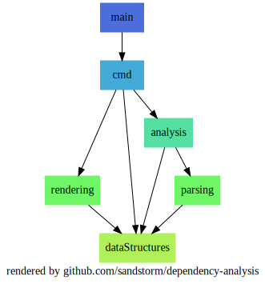
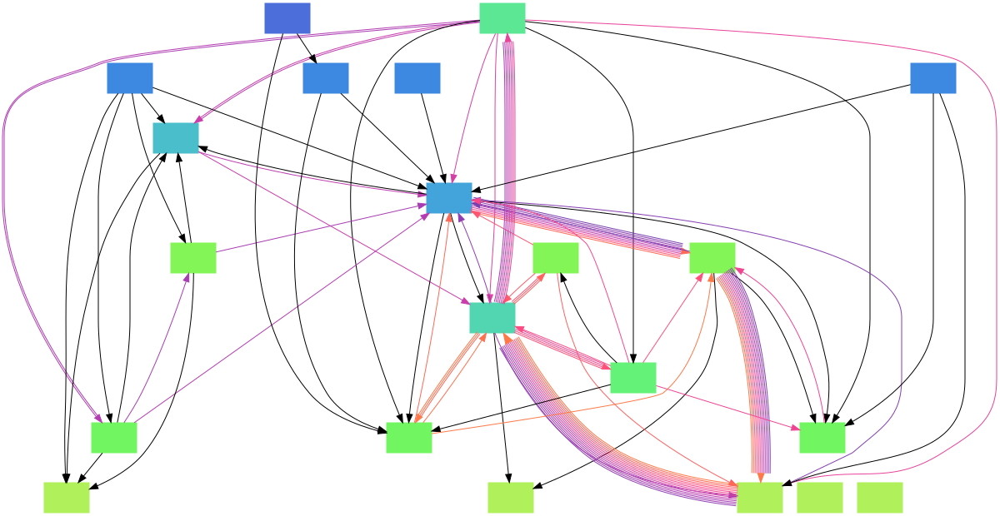

# sda - Sandstorm Dependency Analysis

More often than not software systems are displayed as layers.
The top-most components use the ones below but not vice-versa.
Ideally the package/namespace/module structure reflects the layers, eg:
* features built on top of other features
* REST APIs built on top of DB repositories

However it is easy to loose track of the layering in large projects, violate the structure
and in the worst case introduce cyclic dependencies.

The _sda_ tools visualized the dependencies within a code base in a graph
and validates the cycle-freeness as part of the test pipeline.



## Installation

```shell
# compile sda
go build -o ~/bin/sda

# install GraphViz (with Homebrew on OSX)
brew install graphviz

# show available commands
sda --help

# render and open dependency graph
sda visualize src/

# search and print cycles (exit code equals the number of cycles)
sda validate src/
```

## Supported languages

* golang
* Java
* PHP

# Table of Content

- [sda - Sandstorm Dependency Analysis](#sda---sandstorm-dependency-analysis)
  - [Installation](#installation)
  - [Supported languages](#supported-languages)
- [Table of Content](#table-of-content)
- [User documentation](#user-documentation)
  - [Example: root package recognition](#example-root-package-recognition)
  - [Validate Command](#validate-command)
    - [Output in project with cycles](#output-in-project-with-cycles)
    - [Output in project without cycles](#output-in-project-without-cycles)
  - [Visualize Command](#visualize-command)
    - [Graph with single cycle](#graph-with-single-cycle)
    - [Graph with several cycles](#graph-with-several-cycles)
  - [How to debug and break cycles](#how-to-debug-and-break-cycles)
    - [Cycles disappear with increased depth](#cycles-disappear-with-increased-depth)
    - [Cycles between classes](#cycles-between-classes)
  - [Limitations](#limitations)
    - [Code needs to be neatly formatted](#code-needs-to-be-neatly-formatted)
    - [Imports only](#imports-only)
    - [Commented lines](#commented-lines)
    - [Unused imports](#unused-imports)
- [Developer documentation](#developer-documentation)
  - [Start from source](#start-from-source)
  - [How to add a new command](#how-to-add-a-new-command)
  - [Helpful development commands](#helpful-development-commands)
  - [Documentation of Libraries and Tools](#documentation-of-libraries-and-tools)
- [Glossary](#glossary)

# User documentation

The given source directory is searched for known file types.
All source units (classes in Java/PHP, files in golang) are parsed to collect all dependencies.
Source units and dependencies are described using the full name including the package.
The longest package prefix shared between all source units is then used as root package.

## Example: root package recognition

Given the following Java classes:
* `de.sandstorm.examples.sda.Main`
* `de.sandstorm.examples.sda.http.WebServer`
* `de.sandstorm.examples.sda.model.WebResponse`

The root package is `de.sandstorm.examples.sda` and the top-level packages are:
* `Main`
* `http`
* `model`

Now the dependencies between this top-level packages are analyzed.
You can look deeper into the package structure by
* adjusting the source path
* by setting `--depth` to a value higher `1`

## Validate Command

You can use the _validate_ command in the CI pipeline as a code-quality test.
The exit code equals the numer of cylces in the dependency graph (hopefully zero).

Stdout contains all cycles.

### Output in project with cycles

```
$ sda validate src/main/java
found 2 cycles:

 ┌▶ http
 |   ▼
 |  services
 └───┘

 ┌▶ commands
 |   ▼
 |  http
 |   ▼
 |  services
 └───┘
```

### Output in project without cycles

```
$ sda validate
no cycles found, everything is all right
```

## Visualize Command

To get an overview over a legacy project or to debug and break cyclic dependencies
you can render the depencency graph into an image, such as


The color of the nodes indicated the position in the layering:
more blue packages are higher in the layering,
more green ones lower.

The colors are particulary helpful in tangeld graphs of messy dependencies.

Note that I omit the node labels in the following examples.

### Graph with single cycle

Edges on a cycle have warm colors.


### Graph with several cycles

In larger graphs with multiple cycles the color of the edges
helps to follow single cycles.
Since in the presence of cycles layers cease to exist,
the graph becomes tangled.
The colors of the nodes still indicate on which level the node
*might* be.



## How to debug and break cycles

If you plan to clean up a project and remove cycles I suggest the following:
* start on thick edges to break multiple cycles at once
* increase the `--depth` to get some insights where the cycles come from

### Cycles disappear with increased depth

Lucky you, there are no cycles between classes.
Re-ordering a few classes and packages should do the trick.

### Cycles between classes

You probably need to split a class or two.
Often the cycles appear in classes [which perform several tasks](https://refactoring.guru/smells/large-class).

## Limitations

### Code needs to be neatly formatted

For the sake on simplicity the code parsers built on regular expressions.
They only work on normal formatted code.

### Imports only

The parsers only look at imports/usages within the files.
References without imports are ignored.

### Commented lines

The parsers ignore comments.
Commented imports are treated as normal imports.

### Unused imports

Unused imports are treated as normal imports.

# Developer documentation

* [install Golang](https://golangdocs.com/install-go-mac-os)
* `brew install graphviz`

## Start from source

```sh
go run .
# or
go run . --help
# or
go test ./parsing
```

## How to add a new command

```sh
# install COBRA CLI (see links to docs below)
cobra-cli add helloWorld
# and adjust generated files
```

## Helpful development commands

```sh
# auto-format all .go file
find . -type f -name '*.go' | xargs -Ifile go fmt file
# or
go fmt ./analysis

# print docs
go doc -all ./dataStructures
# or
go doc ./dataStructures

# docs in browser
go install golang.org/x/tools/cmd/godoc@latest
godoc -http=:8080

# visualize all Java projects in current folder
find . -type d | grep -iE 'src/main/java$' | xargs -Isrc bash -c 'export project=$(echo src | cut -d / -f 2); sda visualize src -o $project.svg -l $project'
```

## Documentation of Libraries and Tools

* [Command Line Interface Library: COBRA](https://github.com/spf13/cobra)
* [Printing the Graph: GraphViz Examples](https://renenyffenegger.ch/notes/tools/Graphviz/examples/index)
* [GraphViz rank=same: placing node on the same level](https://stackoverflow.com/questions/14879617/layering-in-graphviz-using-dot-language)
* [colorgrad: Go (Golang) color scales library for data visualization, charts, games, maps, generative art and others](https://github.com/mazznoer/colorgrad)
* [VS Code: Markdown All in One](https://marketplace.visualstudio.com/items?itemName=yzhang.markdown-all-in-one)

# Glossary

* source-unit - smallest source module, eg classes in PHP and Java, prototypes in Fusion
* package - location of a source-unit in a hierarchy, eg packages ind Java, namespaces in PHP, folders in JavaScript
* package segment - one step in the package hierarchy, e.g. _de.sandstorm.test_ consists of the three segments _[de sandstorm test]_
* root package - largest package prefix shared between all source-units
* node - box in a graph
* edge - arrow in a graph
